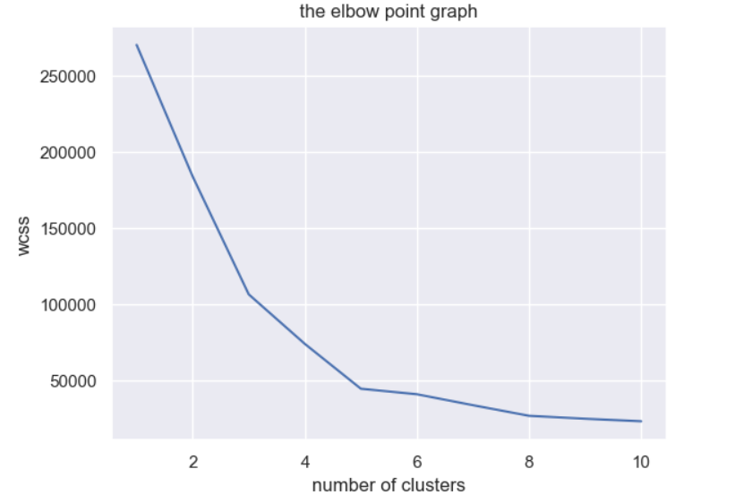
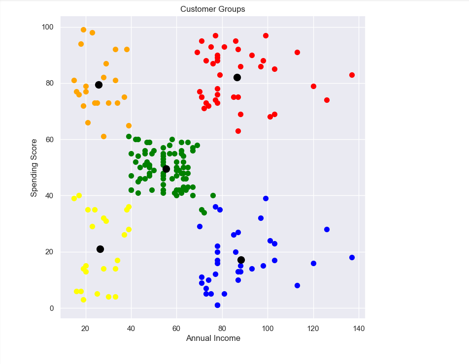

# 🛍️ Mall Customer Segmentation using K-Means Clustering

This project demonstrates how to segment mall customers based on their annual income and spending score using **K-Means Clustering**, a popular unsupervised machine learning algorithm. The goal is to uncover distinct groups of customers to assist businesses in targeting marketing strategies more effectively.

---

## 📚 Table of Contents

- 🎯 [Objective](#-objective)
- 🧾 [Data Collection](#-data-collection)
- 🧹 [Data Preprocessing](#-data-preprocessing)
- 📊 [Finding Optimal Clusters (Elbow Method)](#-finding-optimal-clusters-elbow-method)
- 🤖 [Model Training (K-Means)](#-model-training-k-means)
- 📈 [Visualization](#-visualization)
- 💡 [Business Insights](#-business-insights)
- 🛠️ [Tech Stack](#-tech-stack)
- 📁 [Folder Structure](#-folder-structure)

---

## 🎯 Objective

Group mall customers into clusters based on:
- 💰 **Annual Income**
- 🛒 **Spending Score**

This helps businesses:
- 🎯 Identify high-value customers
- 📢 Target marketing strategies
- 🎁 Design personalized offers

---

## 🧾 Data Collection

📌 Dataset: **Mall Customer Segmentation Data**

Features:
- 🆔 `CustomerID`
- 👤 `Gender`
- 🎂 `Age`
- 💸 `Annual Income (k$)`
- 📉 `Spending Score (1-100)`

---

## 🧹 Data Preprocessing

- ❌ Dropped irrelevant column: `CustomerID`
- ✅ Selected features: `Annual Income`, `Spending Score`
- 🧼 Checked for missing values
- 📐 Scaled or normalized data (if necessary)

---

## 📊 Finding Optimal Clusters (Elbow Method)

- 🧮 Calculated **Within-Cluster-Sum of Squares (WCSS)**
- 📈 Plotted WCSS vs. number of clusters
- 💡 Chose optimal **k** using the **Elbow Point**

---

## 🤖 Model Training (K-Means)

- 🧠 Imported and initialized `KMeans` from `sklearn`
- 🧪 Trained model using selected features
- 🏷️ Predicted cluster labels for each customer

---

## 📈 Visualization

- 🎨 Plotted clusters using:
  - `Matplotlib`
  - `Seaborn`
- 🔘 Different colors represent different clusters
- 📌 Center points marked to show centroids

---

## 💡 Business Insights

The model reveals 5 distinct customer groups:

1. 💎 High income & high spenders
2. 👛 High income & low spenders
3. 🤑 Low income & high spenders
4. 🙁 Low income & low spenders
5. 🧍 Average income/spenders

These insights help:
- 🎯 Target marketing campaigns
- 🎁 Launch loyalty/reward programs
- 📉 Reduce churn and improve ROI

---

## 🛠️ Tech Stack

| Tool         | Purpose                        |
|--------------|--------------------------------|
| 🐍 Python     | Programming Language           |
| 📒 Jupyter    | IDE for running notebooks      |
| 📊 Pandas     | Data manipulation              |
| 🔢 NumPy      | Numerical operations           |
| 📉 Matplotlib | Data visualization             |
| 🖼️ Seaborn    | Enhanced plotting              |
| 🧠 Scikit-learn | Machine Learning model        |

---

## 📁 Folder Structure

mall-customer-clustering/
│
├── 📓 mall_customer_segmentation.ipynb # Jupyter Notebook
├── 📄 mall_customers.csv # Dataset (optional)
├── 📘 README.md # Project documentation
└── 📸 output_plots/ # Cluster visualization images

---

## 📌 Note

This is a great beginner-friendly machine learning project to showcase your skills in:
- 📂 Data preparation
- 📐 Clustering algorithms
- 📊 Data visualization
- 🔍 Business analysis

